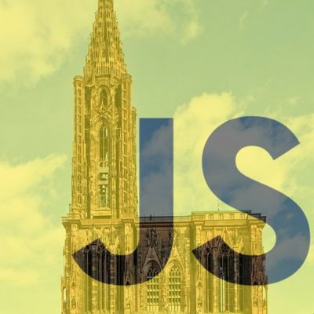

  

# Talks

Call for Paper pour les talks Vue Strasbourg.

## [🗣️ Proposer un sujet en tant que speaker](https://github.com/VueStrasbourg/talks/issues/new?template=talk.md)

## [💡 Proposer une idée de sujet](https://github.com/VueStrasbourg/talks/issues/new?template=talk.md)

## [🗳️ Voter pour un talk](https://github.com/VueStrasbourg/talks/issues?q=is%3Aissue+is%3Aopen+sort%3Aupdated-desc) en utilisant la réaction 👍.

### Liens utiles

🗺️ [Mobilizon](https://mobilizon.fr/@vue_strasbourg) | 🐦 [Twitter](https://twitter.com/VueStrasbourg)

#### Ce repo a été inspiré par :

- [ParisTypeScript/talks](https://github.com/ParisTypeScript/talks)
- [GDGToulouse/meetup-cfp](https://github.com/GDGToulouse/meetup-cfp)